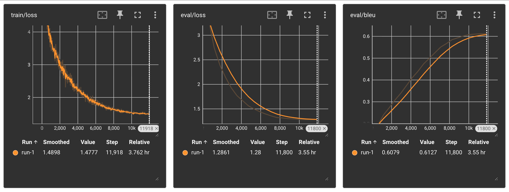

# Transformer from scratch

Implementation of the Transformer architecture, introduced in the paper: ["Attention is all you need"](https://proceedings.neurips.cc/paper_files/paper/2017/file/3f5ee243547dee91fbd053c1c4a845aa-Paper.pdf). This architecture was designed for the task of text translation.

 The present codebase implements:
- The transformer architecture
- A basic tokenizer to convert words into numbers
- Dataset and dataloader for the [WMT 2024 Chat task](https://wmt-chat-task.github.io/2024/)
- The training script for text translation

# Requirements
- tqdm
- regex
- NumPy
- pandas
- PyTorch
- TensorBoard

# Instructions
Clone the repository:
```bash
git clone --recurse-submodules https://github.com/GustavoStahl/transformer-from-scratch.git
```
Or init the submodules in case you have cloned without it:
```bash
git submodule update --init --recursive
```
Install the required python packages:
```bash
# tested with python 3.10
pip install requirements.txt
```
Start the training process:
```bash
python train.py
```
On another terminal, launch tensorboard:
```bash
tensorboard --logdir=runs
```
Access the training visualizer at: http://localhost:6006.



> Skip training with tensorboard by adding the flag `--no-tensorboard`. Example: `python train.py --no-tensorboard`.
